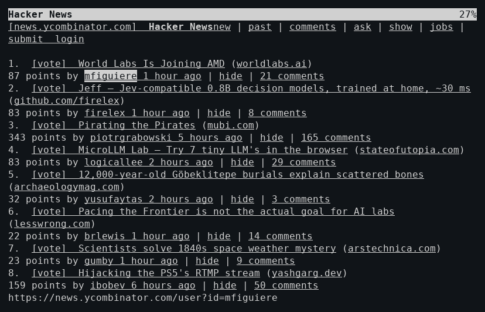
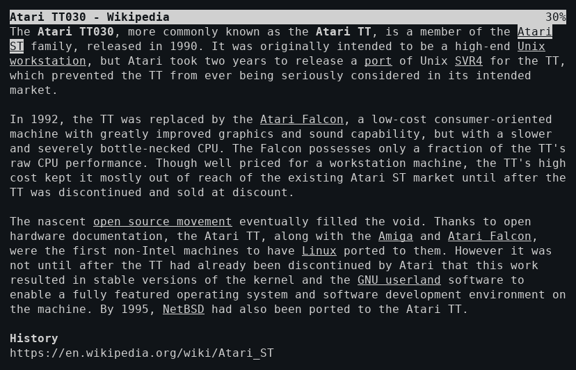
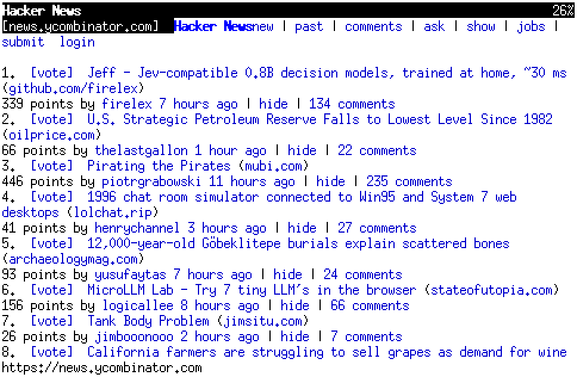

# Manx

A web browser for 68030 System V Unix: **Atari System V** on the TT030 and
**Amiga UNIX** (AMIX). Text frontend today, X11 later. It does HTTPS itself,
on the 68030, in a few megabytes.

Named after Lynx's tailless cousin, and after Manx Software Systems, whose
Aztec C built a good share of the Amiga's and the Atari ST's software.







(Captured from the real TT030 over telnet, and from its X display. More in
[docs/screenshots](docs/screenshots).)

## What it does

- HTTP/1.1 and HTTPS: TLS 1.2 through [BearSSL](https://bearssl.org),
  ChaCha20-Poly1305 and X25519 first. Keep-alive and session resumption.
  Its own DNS resolver, because a static SVR4 program can't use the system's.
- gzip/deflate content, decoded as it arrives. Pages come 4-6x smaller,
  which matters at the TT's 35 KB/s.
- HTML parsed as it streams, into a compact document (16-byte nodes, a
  1.2 MB cap). Lists, `<pre>`, tables row by row, form fields, anchors.
  UTF-8, windows-1252 and Latin-1 pages.
- Forms (GET and POST, every field type, `$EDITOR` for text areas), a
  cookie jar, a disk cache (Back without the network), bookmarks, gopher,
  `file:`.
- Any terminal: its own screen layer on terminfo, not SVR4 curses, which
  can't do UTF-8. UTF-8, Latin-1 or plain ASCII (it asks the terminal which);
  colour where the terminal has it.
- Lynx's keys: Up/Down between links, Right follows, Left goes back.

What it doesn't do: JavaScript, CSS beyond `display:none`, images (yet).

## On the TT030 (68030, 32 MHz)

| | |
|---|---|
| Hacker News fetched over a new TLS session (handshake and certificate check included) | 10 s |
| Wikipedia article fetched (131 KB, 26 KB gzipped), new TLS session | 13 s |
| Hacker News, resumed session: first screen / whole page | 6.5 s / 13.6 s |
| Back to a page in the cache | 1.2 s |
| The browser binary (static, with TLS) | 370 KB |

Checking a certificate chain takes the 68030 5-10 s, and many servers
give up on an idle client well before that. So a request with nothing
private in it (no cookies, no form data) is sent right after the handshake,
and the chain is checked before any of the answer is used. A request with
cookies or form data always waits for the check. `early_requests = off` in
the settings makes every request wait.

## Building

Everything also builds and runs on Linux, for development and tests:

```sh
make                 # build/host/manx, xmanx, manxtrust, ufetch, uparse, benchmarks
make test            # unit tests, TLS known-answer tests
make fuzz            # the HTML engine and layout under ASan/UBSan
```

For the 68030: one static AMIX program, which also runs on Atari System V
through the `amx` module of [atari-sysv-sp1](https://github.com/slaapliedje/atari-sysv-sp1):

```sh
make TARGET=sysv4    # build/sysv4/manx, xmanx, manxtrust
```

`X11=0` leaves `xmanx` out (it needs Xlib: AMIX's static X11R5 `libX11.a`
for the 68030, `libX11` on Linux).

This needs:
- a modern m68k GCC (the mint cross compiler, `m68k-atari-mint-gcc` 15);
- the SVR4 assembler and linker of gcc-cross-amix (`~/opt/asv-cross`);
- an AMIX sysroot, which sp1's `amix/mksysroot.sh` makes from Commodore's
  AMIX 2.1 packages (not included here).

`toolchain/sysv4-cc` explains how the three fit together.

## Running

Copy `manx` and `manxtrust` to the machine. Then, once:

```sh
manxtrust roots cacert.pem   # trusted roots, from any PEM bundle (e.g. curl's cacert.pem)
manxtrust seed               # SVR4 has no /dev/random: type for a while to seed
manx                         # or: manx https://news.ycombinator.com/
```

`xmanx` is the same browser in an X11 window, with controls in the OPEN
LOOK manner of both systems' desktops (Back, Forward, Reload and Stop
buttons, a URL field, a scrollbar with an elevator) and the mouse: a click
follows a link, the wheel scrolls, the keys are the same. The page is set
in the server's Helvetica and Courier (the 75 dpi fonts of X11R5 and
R6.3), headings bigger, italics italic. On Atari System V
it opens `$DISPLAY` over TCP (`:0` becomes `thishost:0`), because AMIX's
X11R5 library and ASV's X11R6.3 server have no local transport in common.

Settings go in `~/.manx/config`, one `key = value` a line, or as
`MANX_KEY` in the environment:

| key | |
|---|---|
| `start` | the start page |
| `search` | where words typed at `g` go (DuckDuckGo Lite) |
| `charset` | the terminal's: `utf-8`, `latin1`, `ascii` (otherwise the terminal is asked) |
| `color`, `link_color` | `off` for none; the links' colour (cyan on a terminal, blue in a window) |
| `font` | `xmanx`'s font for its title and status lines, a fixed-width X font (`fixed`) |
| `proportional` | `off`: `xmanx` shows the page in that font too, as on a terminal |
| `cookies` | `off` for none |
| `cache_kb` | the disk cache's size (2048; 0 for none) |
| `cafile` | a PEM bundle to build the roots from |
| `early_requests` | `off`: send nothing before the certificate is checked |

`?` in the browser lists the keys.

## Status

Phases 0-4 of [PLAN.md](PLAN.md) are done: toolchain, network core, HTML
engine, text browser, then forms, cookies, cache and gzip. Each has a
write-up in [docs](docs), with measurements from the TT. Phase 5, the X11
frontend, is under way: `xmanx` has its window, controls and mouse, and
sets pages in proportional fonts (the layout measures through the
screen's font metrics; on a terminal it counts columns, unchanged).
Next: images, with the TT's transputers as an optional helper.

Tested on an Atari TT030 with Atari System V, and on AMIX 2.1 in an
emulated Amiga 3000 (`tools/amix/`), where it loads Hacker News over HTTPS.
It hasn't been tried on a real Amiga yet.

## Licence

GPL-2.0 (see [LICENSE](LICENSE)). BearSSL, in `third_party/bearssl`, is MIT
licensed; `third_party/patches` has the one change made to it.
